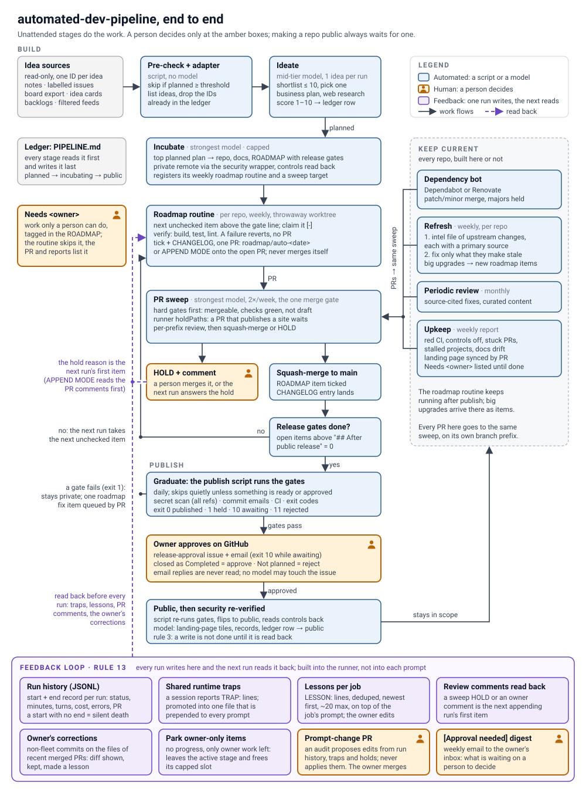

# automated-dev-pipeline — Skill-Data

## What the skill does

[`automated-dev-pipeline`](../../../../../Skills/Core/Automation/automated-dev-pipeline/SKILL.md) sets up and audits scheduled AI agents that do development work unattended: ideas become plans, plans become private repos that grow one verified PR at a time, a single sweep reviews and merges, publishing waits on scripted gates plus a human approval, and keep-current jobs cover every repo afterwards.

## The flow diagram

[`pipeline-flow.svg`](../../../../../Skills/Core/Automation/automated-dev-pipeline/pipeline-flow.svg), which ships in the skill folder beside `SKILL.md`, draws the whole pipeline on one page:

| Part | What it shows |
|:---|:---|
| **Build** | Idea sources → pre-check and adapter → ideate → incubate → roadmap routine → PR sweep, with HOLD or merge |
| **Publish** | Release gates → the publish script's gates → owner approval on the issue → public, then security re-verified |
| **Keep current** | Dependency bot, refresh, periodic review and upkeep, all feeding the same sweep |
| **Feedback loop** | Rule 13: run history, runtime traps, lessons, comments and the owner's corrections read back, parking, the prompt-change PR and the weekly `[Approval needed]` digest |

Amber boxes are where a person decides. Dashed purple arrows are what the next run reads back.

It is hand-written SVG with no external fonts or scripts and its own white background, so it reads the same in GitHub and in a dark VS Code preview. Edit it directly. Stage names and labels come from the skill's `SKILL.md` and `references/`, so when the skill changes a stage, change the drawing in the same PR.

## About this folder

Supporting material about the skill. Nothing here is read at runtime; the skill is self-contained in its leaf folder.

| Path | What it is |
|:---|:---|
| [`pipeline-flow.svg`](../../../../../Skills/Core/Automation/automated-dev-pipeline/pipeline-flow.svg) | The end-to-end flow diagram, 1000 × 1345. It lives in the skill folder, so it installs with the skill; this folder only describes it. |

---

  <a href="../../../../README.md">← Resources home</a> ·
  <a href="../../../../../Skills/Core/Automation/automated-dev-pipeline/SKILL.md">The skill →</a>

